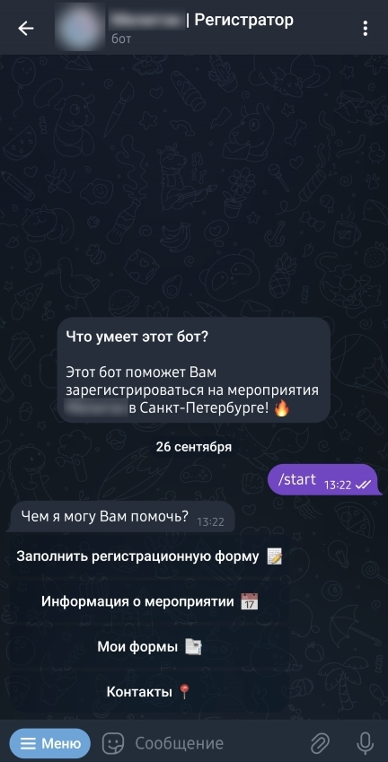
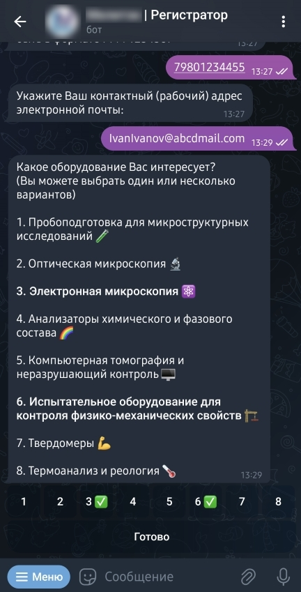
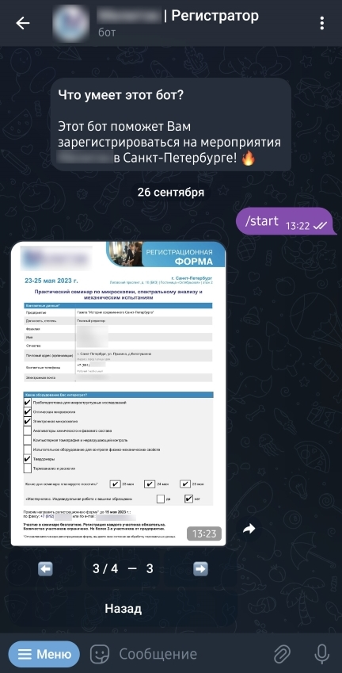

# Registrator TG Bot | Бот регистратор
Telegram бот для быстрой и удобной регистрации клиентов на мероприятия компании "М".

**Деплой актуальной версии бота можно найти [здесь](https://t.me/MelytecSPB_bot/).**

* [О проекте](#about)
* [Скриншоты](#screenshot)
* [Установка и запуск](#install)
* [Структура проекта](#structure)
* [Технологический стек](#stack)

<div id="about"/>

## О проекте

Проект был создан с целью решения актуальной коммерческой задачи: упрощения и ускорения процедуры регистрации более чем 200 гостей на ежегодный семинар компании "M". Это позволило значительно сэкономить время, которое ранее требовалось организатору на регистрацию участников. Также проект улучшает опыт клиентов, обеспечивая легкую регистрацию.

### Возможности бота

Пользователю доступны:
- Просмотр программы мероприятия и контактов организатора 
- Заполнение анкеты участника по заданному шаблону pdf (регистрационная форма)
- Автоматическая отправка регистрационных данных организатору по email
- Просмотр заполненных форм 

<div id="screenshot"/>

## Скриншоты

Скриншоты работы задеплоенного бота с реальными входными данными:











<div id="install"/>

## Установка и запуск

1. Клонируйте репозиторий:

```bash
git clone https://github.com/ZaprostoNeprosto/registrator-tg-bot.git
cd registrator-tg-bot
```

2. Установите зависимости проекта:

```bash
npm install
```

3. Создайте файл `.env` в папке `src/config` и вставьте туда ваши токены, как указано в примере `env.example`.


4. Для запуска бота в текущей конфигурации вам также будут необходимы:

   - Токен экземпляра бота в Telegram (узнать о том, как создать бота и получить токен, можно [здесь](https://telegram.org/faq#q-how-do-i-create-a-bot)). 
   - Предварительно созданный кластер базы данных в MongoDB (подробнее о работе с MongoDB [здесь](https://www.mongodb.com/docs/drivers/node/current/quick-start/)).
   - Аккаунт одного из провайдеров электронной почты, например Gmail (подробнее о требованиях к почтовой службе [здесь](https://nodemailer.com/)).
   - Изображения с актуальной информации о мероприятии (необходимо заменить ими существующие изображения по пути `src/data/input/shedule`), .
   - Шаблон pdf регистрационной формы (необходимо заменить существующий шаблон по пути `src/data/input/template_PDF`).


5. Запустите бота:

```bash
npm start
```

---
<div id="structure"/>

## Структура проекта

- **[ index.js ]** - точка входа для запуска бота.
- **[ public ]** - статичные файлы (изображения для `README.md`).
- **[ src ]** - основная папка с файлами проекта.
    - **[ config ]** - файлы конфигурации и токены (`.env`).
    - **[ modules ]** - модули бота.
        - **[ actions ]** -  обработчики событий и действий бота.
        - **[ commands ]** - обработчики команд бота.
        - **[ functions ]** - вспомогательные функциональные модули бота.
        - **[ stage ]** - сцены бота для организации диалогов.
          - **[ questions ]** - модули алгоритма опросника (анкета для клиентов).
    - **[ data ]** - каталог с файлами бота.
        - **[ input ]** - исходные файлы (описание мероприятия, шаблон `.pdf`, файл шрифта).
        - **[ output ]** - сгенерированные файлы (заполненные анкеты в `.txt`, `.pdf`, `.jpg`).
---
<div id="stack"/>

## Технологический стек

- Среда [Node.js (18.16.1)](https://nodejs.org/en/)

- Библиотека [Telegraf.js](https://github.com/telegraf/telegraf/) - взаимодействие с API Telegram.

- База данных [MongoDB](https://www.mongodb.com/) - сохранение пользовательских данных.

- Библиотека [pdf-lib](https://github.com/Hopding/pdf-lib/) - заполнение pdf по шаблону.

- Библиотека [fontkit](https://github.com/Hopding/fontkit/) - работа со шрифтами в pdf.

- Библиотека [pdf-to-img](https://github.com/k-yle/pdf-to-img/) - получение скриншота заполненной pdf формы.

- Библиотека [nodemailer](https://github.com/nodemailer/nodemailer/) - отправка данных по email.
